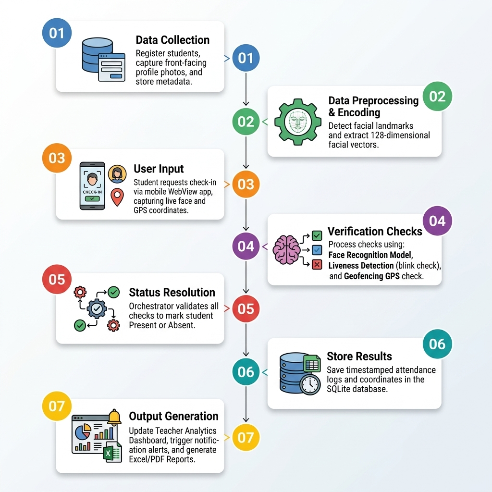

<p align="center">
  
</p>

<h1 align="center">🎓 Smart Attendance System</h1>
<h3 align="center">AI-Powered Face Recognition & Geofencing for Automated Attendance</h3>

<p align="center">
  
  
  
  
  
</p>

<p align="center">
  <a href="#-features">Features</a> •
  <a href="#-tech-stack">Tech Stack</a> •
  <a href="#-architecture">Architecture</a> •
  <a href="#-installation">Installation</a> •
  <a href="#-usage">Usage</a> •
  <a href="#-api-endpoints">API</a> •
  <a href="#-team">Team</a>
</p>

---

## 📌 About

The **Smart Attendance System** is a next-generation attendance management platform that eliminates proxy attendance and manual roll calls using **real-time face recognition**, **liveness detection**, and **GPS geofencing**. Built for colleges and universities, it provides role-based dashboards for **Students**, **Teachers**, and **Admins** with real-time notifications, analytics, and downloadable reports.

> 🛡️ **Anti-Spoofing Protected** — Uses MiniFASNet ONNX deep learning models + blink detection + FFT moiré analysis to prevent photo/screen-based spoofing attacks.

---

## ✨ Features

### 🔐 Authentication & Security
- **Role-Based Access Control** — Separate portals for Students, Teachers & Admins
- **Strong Password Policy** — Enforced complexity (uppercase, lowercase, digits, symbols)
- **Duplicate Face Detection** — Prevents same face from registering multiple accounts
- **Session-Based Auth** — Secure Django session management

### 👤 Face Recognition Engine
- **128-Dimensional Face Encoding** — High-accuracy facial feature extraction using `dlib`
- **Multi-Image Registration** — Average encoding from multiple photos for better accuracy
- **HOG-Based Detection** — Fast & reliable face detection model
- **EXIF-Aware Processing** — Auto-rotates images based on camera orientation metadata

### 🛡️ Anti-Spoofing & Liveness Detection
- **Blink Detection (EAR)** — Eye Aspect Ratio analysis across two frames to confirm live person
- **Screen Glare Detection** — HSV color space analysis to detect reflective screen surfaces
- **Moiré Pattern Analysis** — FFT-based frequency domain analysis to detect screen pixel grids
- **Blur Detection** — Laplacian variance to catch re-photographed images
- **MiniFASNet V2 (Deep Learning)** — ONNX-based neural network for real vs. fake face classification
- **Chrominance Flatness Check** — YCrCb color space analysis to detect printout attacks

### 📍 Geofence Verification
- **Haversine Formula** — GPS distance calculation between student and classroom coordinates
- **Configurable Radius** — Adjustable geofence boundary (default: 1km)
- **Teacher-Anchored Location** — Session geofence centered on teacher's location when starting attendance

### 📊 Dashboards & Analytics
- **Student Dashboard** — Attendance percentage, subject-wise breakdown, weekly timetable
- **Teacher Dashboard** — Section management, live session monitoring, student attendance grid
- **Admin Dashboard** — Complete system oversight, user management, schedule configuration
- **Real-Time Notifications** — Push notifications when attendance sessions start

### 📋 Reports & Data Export
- **Attendance Logs** — Filterable by date, student, and status
- **CSV Downloads** — Export attendance registers, logs, and reports
- **Subject-Wise Analytics** — Track attendance trends per subject/section

### 📱 Mobile Companion App
- **Android APK** — Native mobile app for on-the-go attendance marking
- **Camera Integration** — In-app face capture with liveness verification
- **GPS Integration** — Automatic location verification

---

## 🛠️ Tech Stack

| Layer | Technology |
|-------|-----------|
| **Backend Framework** | Django 4.2+ (Python) |
| **Face Recognition** | `face_recognition` + `dlib` |
| **Computer Vision** | OpenCV 4.8, Pillow |
| **Anti-Spoofing** | MiniFASNet V2 (ONNX Runtime) |
| **Database** | SQLite 3 |
| **Frontend** | HTML5, CSS3, JavaScript |
| **Geolocation** | Haversine Formula + Browser Geolocation API |
| **Deployment** | Docker, Gunicorn, Render/Heroku |
| **Mobile** | Android (APK) |

---

## 🏗️ Architecture

```
smart-attendance-using-face-recognition/
├── 📁 attendance/                  # Main Django app
│   ├── models.py                   # Database models (User, Section, Schedule, etc.)
│   ├── views.py                    # All view handlers & business logic
│   ├── helpers.py                  # Face recognition, liveness, geofencing
│   ├── urls.py                     # URL routing
│   └── anti_spoofing_models/       # ONNX deep learning models
│       ├── MiniFASNetV1SE.onnx
│       └── MiniFASNetV2.onnx
├── 📁 config/                      # Django project configuration
│   ├── settings.py                 # App settings
│   ├── urls.py                     # Root URL configuration
│   └── wsgi.py                     # WSGI entry point
├── 📁 templates/                   # HTML templates
│   ├── login.html                  # Student login page
│   ├── teacher_login.html          # Teacher portal
│   ├── admin_dashboard.html        # Admin control panel
│   ├── teacher_dashboard.html      # Teacher management view
│   ├── student_dashboard.html      # Student overview
│   ├── mark_attendance_page.html   # Face capture & attendance marking
│   └── ...                         # 10+ more templates
├── 📁 static/                      # Static assets
│   ├── css/style.css               # Application styles
│   ├── js/face_capture.js          # Camera & face capture logic
│   └── images/                     # UI assets
├── manage.py                       # Django management script
├── requirements.txt                # Python dependencies
├── Dockerfile                      # Docker containerization
├── Procfile                        # Heroku/Render deployment
└── README.md                       # You are here!
```

---

## 🚀 Installation

### Prerequisites
- Python 3.11+
- pip
- Git
- CMake *(for dlib compilation on Linux/Mac)* or use `dlib-bin` on Windows

### Quick Start

```bash
# 1. Clone the repository
git clone https://github.com/Vikram30069/smart-attendance-using-face-recognition.git
cd smart-attendance-using-face-recognition

# 2. Create virtual environment
python -m venv .venv

# Windows
.venv\Scripts\activate

# Linux/Mac
source .venv/bin/activate

# 3. Install dependencies
pip install -r requirements.txt

# Windows users: If dlib fails to build, use pre-built wheel:
pip install dlib-bin
pip install --no-deps face_recognition

# 4. Run database migrations
python manage.py migrate

# 5. Start the development server
python manage.py runserver
```

🎉 Open **http://127.0.0.1:8000** in your browser!

### 🐳 Docker Deployment

```bash
# Build the image
docker build -t smart-attendance .

# Run the container
docker run -p 8000:8000 smart-attendance
```

---

## 📖 Usage

### Default Credentials

| Role | Username | Password |
|------|----------|----------|
| Admin | `admin` | `admin123` |

### Workflow

1. **Admin** registers teachers and configures class schedules
2. **Students** sign up with face photos (multi-angle recommended)
3. **Teachers** start attendance sessions from their dashboard during class hours
4. **Students** mark attendance via face capture — the system verifies:
   - ✅ Face identity match
   - ✅ Liveness (not a photo/screen)
   - ✅ GPS location within geofence
   - ✅ Session is active and within time window
5. **Reports** are generated automatically and can be exported as CSV

---

## 🔌 API Endpoints

| Method | Endpoint | Description |
|--------|----------|-------------|
| `GET` | `/login` | Student login page |
| `GET` | `/teacher_login` | Teacher login portal |
| `GET` | `/signup` | Student self-registration |
| `GET` | `/dashboard` | Role-based dashboard |
| `POST` | `/mark_attendance` | Mark attendance with face + location |
| `POST` | `/start_session` | Teacher starts attendance session |
| `POST` | `/stop_session` | Teacher ends attendance session |
| `GET` | `/attendance_logs` | View attendance history |
| `GET` | `/reports` | Generate attendance reports |
| `GET` | `/api/notifications` | Get unread notifications |
| `GET` | `/teacher/download_register` | Download attendance register (CSV) |
| `GET` | `/admin/download_logs` | Download attendance logs (CSV) |
| `GET` | `/admin/download_reports` | Download reports (CSV) |

---

## 🔧 Configuration

### Geofence Settings
Update the campus coordinates in `attendance/helpers.py`:
```python
GEOFENCE_CENTER = (12.9715987, 77.594566)  # Your campus lat, lng
GEOFENCE_RADIUS_METERS = 1000               # Radius in meters
```

### Face Recognition Tolerance
Adjust the matching threshold in `attendance/helpers.py`:
```python
# Lower = stricter matching (fewer false positives)
# Higher = looser matching (fewer false negatives)
distance < 0.45  # Default threshold
```

---

## 👥 Team

| Name | Role |
|------|------|
| **Vikram** | Full-Stack Developer |
| **Ashwanth** | Backend & Face Recognition |
| **Team Members** | UI/UX, Testing & Documentation |

---

## 📜 License

This project is built for academic purposes as part of a college team project.

---

## 🙏 Acknowledgments

- [face_recognition](https://github.com/ageitgey/face_recognition) — Face encoding & comparison
- [dlib](http://dlib.net/) — ML toolkit powering face detection
- [OpenCV](https://opencv.org/) — Computer vision operations
- [MiniFASNet](https://github.com/minivision-ai/Silent-Face-Anti-Spoofing) — Anti-spoofing model architecture
- [Django](https://www.djangoproject.com/) — Web framework

---

<p align="center">
  Made with ❤️ for smarter classrooms
</p>
