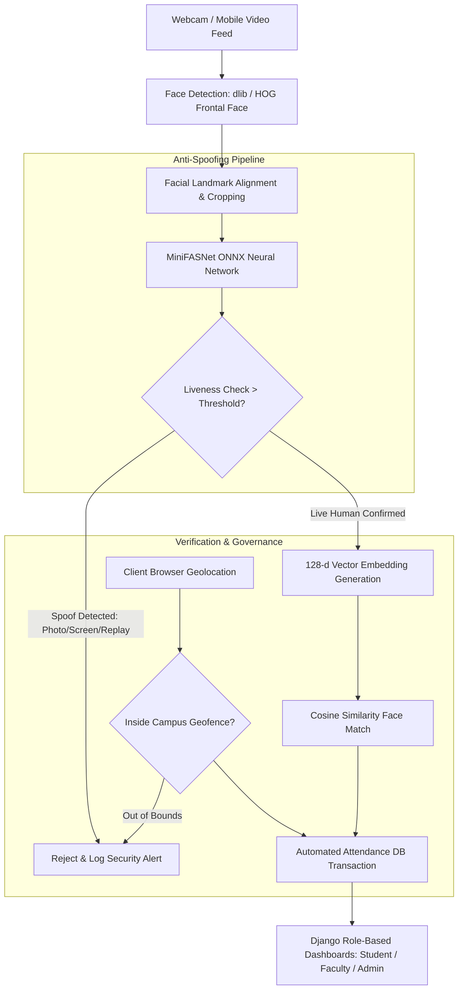

<div align="center">

# Smart Attendance System: Edge Face Recognition & Geofencing

### Automated Attendance Verification via OpenCV, MiniFASNet ONNX Anti-Spoofing & Geolocation

[](https://www.python.org/)
[](https://www.djangoproject.com/)
[](https://opencv.org/)
[](Dockerfile)
[](LICENSE)

---

> **Institutional Security & Verification**: An enterprise-grade automated attendance management platform designed for universities and colleges. Replaces manual roll calls and proxy sign-ins with **real-time facial feature extraction**, **MiniFASNet ONNX neural liveness verification**, and **GPS geofence radius validation**.

</div>

---

## 1. System Architecture


```mermaid
graph TD
    CAM[Webcam / Mobile Video Feed] --> DETECT[Face Detection: dlib / HOG Frontal Face]
    DETECT --> ALIGN[Facial Landmark Alignment & Cropping]
    
    subgraph Anti-Spoofing Pipeline
        ALIGN --> ONNX[MiniFASNet ONNX Neural Network]
        ONNX --> LIVENESS{Liveness Check > Threshold?}
    end

    LIVENESS -->|Spoof Detected: Photo/Screen/Replay| REJECT[Reject & Log Security Alert]
    LIVENESS -->|Live Human Confirmed| EMBED[128-d Vector Embedding Generation]

    subgraph Verification & Governance
        EMBED --> MATCH[Cosine Similarity Face Match]
        GPS[Client Browser Geolocation] --> GEO{Inside Campus Geofence?}
        GEO -->|Out of Bounds| REJECT
        GEO & MATCH --> LOG[Automated Attendance DB Transaction]
    end

    LOG --> DASH[Django Role-Based Dashboards: Student / Faculty / Admin]
```

---

## 2. Core Technical Capabilities

1. **Facial Recognition Engine**: Real-time face detection using dlib landmark predictors and 128-dimensional deep feature embeddings.
2. **MiniFASNet ONNX Anti-Spoofing**: Defends against 2D printed photograph attacks, tablet screen replays, and video masks using high-frequency texture analysis.
3. **GPS Geofence Validation**: Validates the student’s physical browser coordinates against designated lecture hall coordinates using the Haversine formula.
4. **Institutional RBAC Dashboards**:
   - **Student Dashboard**: Real-time subject-wise percentage tracking, deficiency warnings (<75%), and historical timestamps.
   - **Teacher Dashboard**: Live classroom session activation, real-time verified student rosters, and manual override controls.
   - **Administrator Console**: Timetable scheduling, bulk student registration, and department-wide audit exports.

---

## 3. Technology Stack

- **Web Framework**: Python 3.11, Django 4.2+
- **Computer Vision**: OpenCV, dlib, `face_recognition`
- **Deep Learning Inference**: ONNX Runtime (MiniFASNet model)
- **Database**: SQLite (Development) / PostgreSQL (Production ready)
- **Deployment**: Docker, Gunicorn, WhiteNoise

---

## 4. Project Structure

```
smart-attendance-using-face-recognition/
├── attendance/                 # Core Django application
│   ├── models.py               # Student, Faculty, Subject, Timetable, Log schemas
│   ├── views.py                # Recognition endpoints & dashboard views
│   ├── face_processor.py       # OpenCV & dlib recognition pipeline
│   └── liveness_detector.py    # MiniFASNet ONNX inference engine
├── config/                     # Django project settings & URLs
├── templates/                  # Role-based responsive HTML templates
├── static/                     # CSS, JS, and UI assets
├── evaluate_accuracy.py        # Recognition accuracy benchmark script
├── populate_college_timetable.py # Seed script for academic schedules
├── Dockerfile
├── requirements.txt
└── README.md
```

---

## 5. Quickstart & Installation

### Option A: Run via Docker (Recommended)

```bash
git clone https://github.com/Vikram30069/smart-attendance-using-face-recognition.git
cd smart-attendance-using-face-recognition
docker build -t smart-attendance .
docker run -p 8000:8000 smart-attendance
```

### Option B: Local Python Setup

1. **Set up virtual environment:**
   ```bash
   python -m venv venv
   source venv/bin/activate  # On Windows: venv\Scripts\activate
   pip install -r requirements.txt
   ```

2. **Run database migrations & seed schedules:**
   ```bash
   python manage.py migrate
   python populate_college_timetable.py
   ```

3. **Start development server:**
   ```bash
   python manage.py runserver
   ```
   Open `http://localhost:8000` in your browser.

---

## 6. License

This project is licensed under the MIT License — see the [LICENSE](LICENSE) file for details.
